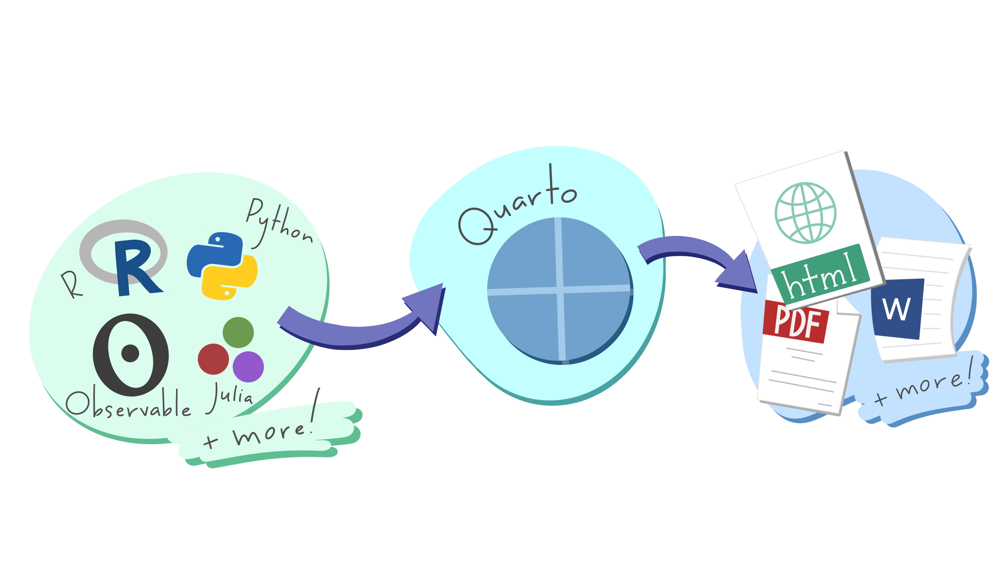

# Quarto showcase

_This panel is part of the 2025 University California Love Data Week program 
(uc-love-data-week.github.io) and is open to all UC affiliates._

Quarto is a publication a multi- scripting languages data analysis and visualization
platform, often used in conjunction with code notebooks. Quarto enables
a more reproducible approach to data-driven research by integrating
documentation, code, and results in one document. But it’s also a great
publication platform on its own! In this session a panel of Quarto users
will showcase what Quarto is capable of, especially when used in concert
with GitHub Pages hosting, including creating websites (course websites,
personal websites, blogs), presentations, dashboards, academic papers,
and books. We will also demonstrate, in real-time, how easy it is to
create such research deliverable.

Be prepared to be sold on using Quarto!

**[Supporting Website](https://ucsb-library-research-data-services.github.io/ucldw25-quarto-showcase/quarto_intro.html)**

### Panelists (in alphabetical order): 

Julien Brun, Renata G. Curty, Greg Janée, Jairo Melo-Flórez, Sam Shanny-Csik

  

